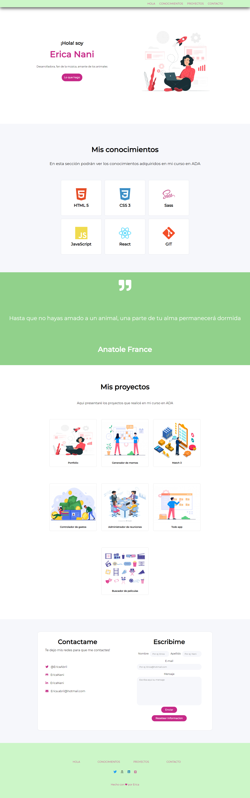

# Portafolio de Ada

### En este proyecto van a ver volcados todos los conocimientos que fui desarrollando durante el primero módulo de mi curso de FrontEnd en ADA. Use paletas de colores suaves para dar armonía y a la vez son atractivos a la vista. ¡Espero les guste!
 

***

### Si quieres ver como quedo el módelo final, puedes darle click a este [enlace](https://ericanani.github.io/Proyecto/) o puedes hacerlo desde [acá](https://zen-liskov-dd5ef0.netlify.app).
 

***
 

### Si quieres tener el código en tu computador deberás seguir estos pasos en tu terminal.

- Ir al [repositorio](https://github.com/EricaNani/Proyecto)
- Darle click al botón de code
- Copiar la url
- Abrir tu terminal y poner el comando de **git clone <url>**
- Entrar a la carpeta del proyecto y abrirlo en tu IDE.

***
 

### Este proyecto no necesita la intalación de ninguna dependencia, por ahora!

***
 

### Una vez finalizada la descarga del proyecto, deberías verlo así..
 

***
 

### Este portafolio lo logré gracias a la gran enseñanza y paciencia de [John Parra](https://github.com/Jonhks) y [Leydy Moreno](https://github.com/leydyk93/) 

 

### De Erica con mucho 💜 para ustedes!

